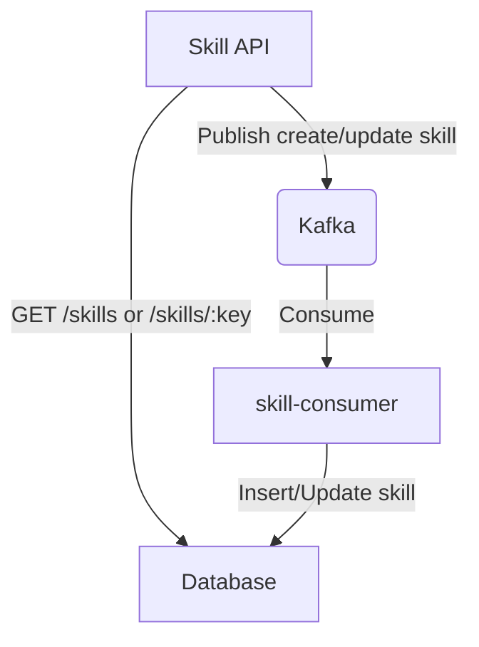

# Skill management API with Kafka

## Instructions

1. MUST create a new project using Go [Gin Gonic framework] repository name `skill-api-kafka`
1. Could pair with a partner / solo
1. SHOULD use docker-compose to run Kafka and PostgreSQL
1. MUST write e2e tests for the API using [Playwright]
1. SHOULD write unit tests for the API using Go testing package
1. SHOULD design kafka topics for the API by yourself
1. MUST place the consumer in the same repository
1. OPTIONAL project structure will be like this:

```bash
skill-api-kafka
├── api
│   ├── Dockerfile
│   ├── go.mod
│   ├── go.sum
│   ├── main.go
│   └── skill
│       ├── skill.go
│       ├── handler.go
│       ├── producer.go
│       └── ....go
├── consumer
│   ├── Dockerfile
│   ├── go.mod
│   ├── go.sum
│   ├── main.go
│   ├── skill
│   │   ├── skill.go
│   │   ├── handler.go
│   │   ├── consumer.go
│   │   └── ....go
│   └── skill
├── e2e
│   └── ...
└── docker-compose.yml
```

9. YOU CAN MAKE ANY ASSUMPTION to make the api working. for example response message or any flow that it will make the api working.

## Context

This API is used to manage skills. Deals with the new architecture of the skill management API, which now uses Kafka to handle the messages.
for retrieving skills will work as before which is to query the database directly.

- `GET /api/v1/skills/:key` - Get a skill by key (query the database directly)
- `GET /api/v1/skills` - Get all skills (query the database directly)

For the other operations, the API will publish messages to Kafka topics. The messages will be consumed by the skill service to perform the operations.

- `POST /api/v1/skills` - Create a skill (publish a message to kafka then expect the skill-consumer to insert the skill into the database)
- `PUT /api/v1/skills/:key` - Update a skill (publish a message to the kafka then expect the skill-consumer will update the skill into the database)
- `PATCH /api/v1/skills/:key/actions/name` - Update the name of a skill (publish a message to the kafka then expect the skill-consumer will update _skill name_ the skill into the database)
- `PATCH /api/v1/skills/:key/actions/description` - Update the description of a skill (publish a message to the kafka then expect the skill-consumer will update _skill description_ the skill into the database)
- `PATCH /api/v1/skills/:key/actions/logo` - Update the logo of a skill (publish a message to the kafka then expect the skill-consumer will update _skill logo_ the skill into the database)
- `PATCH /api/v1/skills/:key/actions/tags` - Update the tags of a skill (publish a message to the kafka then expect the skill-consumer will update _skill tags_ the skill into the database)
- `DELETE /api/v1/skills/:key` - Delete a skill (publish a message to the kafka then expect the skill-consumer will delete the skill from the database)

## Diagram


